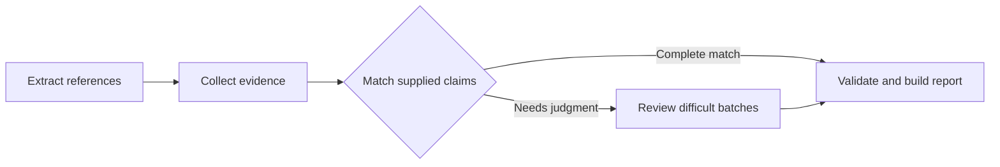

# Shepherd citation checker

An installable Shepherd package for checking bibliographic references in PDFs.
It retains evidence, explains confirmed errors and proposes supported corrections.
It checks work identity and citation metadata, not whether a paper supports a claim.



Install the checker with Shepherd 0.3.1:

```bash
python -m pip install --upgrade "shepherd-ai[citation-checker]==0.3.1"
claude auth login
shepherd-check-citations paper paper.pdf --output citation-report
```

Live reviews require Git, Python 3.11+, Claude Code signed in with a subscription,
and a supported native jail (macOS Seatbelt or Linux Landlock). The checker uses
the headless CLI; API-key and token overrides are not its supported authentication
path. PDF extraction and deterministic checks do not require model authentication.

For development in this repository, run `uv sync` and `make test-citation-checker`.
The workspace package wheel uses internal dependency names; public users install
through the bundled `shepherd-ai` distribution above.

Python API:

```python
from shepherd_citation_checker import check_paper
report = check_paper("paper.pdf", "citation-report")
```

The package registers its tasks through `shepherd.packages`. `check_citations`
composes five `@shepherd.task` stages. Only `review_citation_batch` invokes Opus;
ordinary code handles extraction, collection, exact matching and reporting.
Reviewer sessions use the existing native jail and Claude Code subscription login.
A supported native jail and the matching Shepherd 0.3 runtime are required for live
reviews. Each batch has a 300-second provider budget, 360-second worker budget,
six searches and twelve fetches. Defaults: six citations per batch, five workers.

Reports contain original citations, field findings, source links and supported
BibTeX corrections. Missing evidence remains uncertain. Complete exact matches
bypass Opus; a real identifier alone cannot verify incorrect title/author metadata.
The evidence adapters retain complete source records behind bounded previews.

Artifacts include `manifest.json`, `citations.json`, `evidence/`, `routing.json`,
`jobs/`, `report.json`, `report.md`, `corrections.bib`, `task-trace.json` and
`task-graph.json`. The task trace records the actual parent/stage execution; the
graph links reviewer batch stages to their retained jailed Shepherd runs. Each
run freezes its package source, dependencies, input hashes and initial evidence.
Completed results survive partial session failures. Existing receipts are reused.

For fixed-evidence evaluation, use `check_references(..., evidence={id: [paths]},
retrieve_initial=False, config=CheckerConfig(searches=0, fetches=0))`, or:

```bash
shepherd-check-citations references prepared.json --evidence-only --output replay
```

The checker never reads benchmark gold. Repository-only [evaluation tools and
measured results](evaluation/README.md) are separate from the installed runtime.
The [original candidate](docs/original-candidate/README.md) is retained for the demo;
the archive contains the initial task and its report.

From the workspace root, run `make test-citation-checker`. These offline tests
exercise the installed package, exact-match escalation, source coverage, claim
scope, partial-output recovery, frozen inputs and the retained benchmark scores.
A package refactor is not evidence of improved accuracy: the recorded final run
scores 116/140, with one unfinished citation counted as a failure.
The [validation scope](docs/VALIDATION.md) describes package and release checks.
